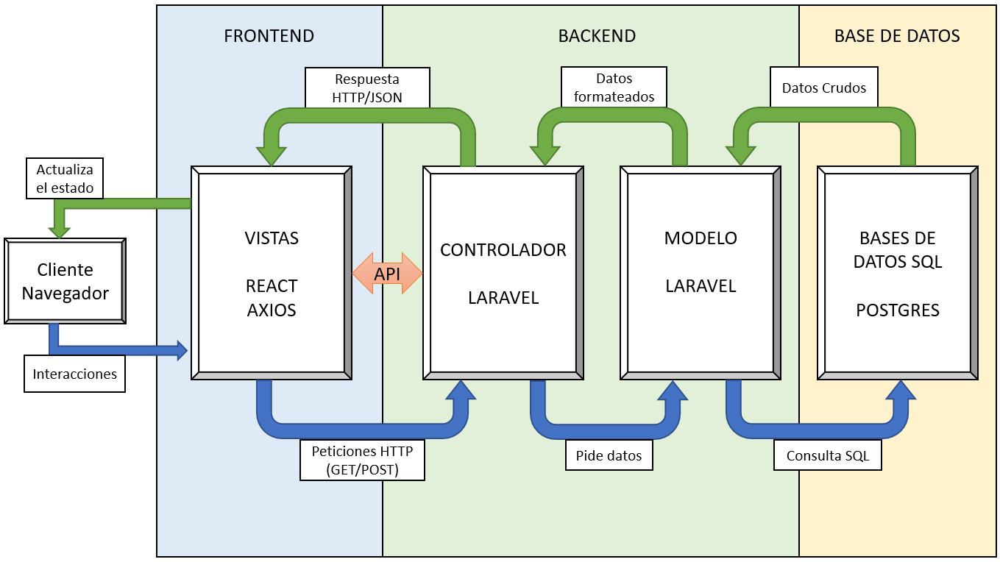
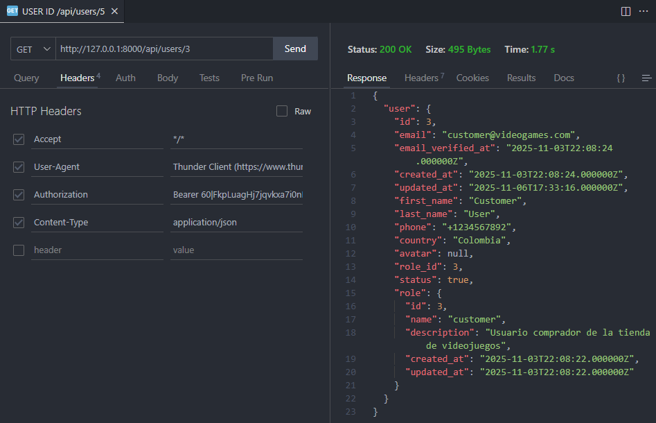

# 🎮 GameStore - Backend API (Laravel + PHP + PostgreSQL)

**GameStore** es una API RESTful desarrollada con **Laravel 11**, **PHP 8**y **PostgreSQL**, que sirve como backend para un sistema completo de gestión de videojuegos digitales.
Este repositorio contiene toda la lógica de negocio, autenticación, gestión de productos y procesamiento de órdenes para la plataforma.

El objetivo del proyecto es proporcionar una API robusta y escalable que soporte operaciones de e-commerce, gestión de usuarios con roles, y administración de contenido digital.

## 🖼️ Vista previa





## 🧠 Características principales

- 🔐 **Autenticación basada en tokens** con *Laravel Sanctum*
- 👥 **Gestión de roles** (Manager › Admin › Customer)
- 🛍️ **Administración de productos, categorías y órdenes**
- 📊 **Estructura MVC** limpia y modular
- 💬 **Respuestas JSON estandarizadas** (sin vistas Blade)
- 🧱 **Base de datos PostgreSQL** con migraciones y seeders integrados
- 🔄 **CORS configurado** para consumo desde frontend (React)
- 🧾 **Documentación técnica y diagramas ERD adjuntos**

## 🧩 Tecnologías utilizadas
- **PHP 8.3 + Laravel 12** Lenguaje principal
- **PostgreSQL 16** Base de datos
- **Eloquent (Laravel ORM)** ORM / Migraciones
- **Laravel Sanctum** Autenticación
- **Composer + Artisan CLI** Entorno local
- **PHP, Composer** Dependencias globales
- **Visual Studio Code** IDE sugerido

## 🚀 Guía de instalación

Sigue estos pasos para ejecutar el backend en tu entorno local:
(Asegúrate de tener PHP ≥ 8.2 y Composer instalados)

```bash
# 1️⃣ Clonar el repositorio
git clone https://github.com/tuusuario/backend-videogames-store.git

# 2️⃣ Entrar al directorio del proyecto
cd backend-videogames-store

# 3️⃣ Instalar dependencias
composer install

#4️⃣ Configurar variables de entorno
cp .env.example .env

# 5️⃣ Ejecutar el entorno local, edita las líneas relacionadas con PostgreSQL

DB_CONNECTION=pgsql
DB_HOST=127.0.0.1
DB_PORT=5432
DB_DATABASE=gamestore_db
DB_USERNAME=postgres
DB_PASSWORD=tu_contraseña

# 5️⃣ Generar la key de aplicación y Ejecutar migraciones y seeders
php artisan key:generate
php artisan migrate --seed

#Esto crea las tablas base (roles, users, etc.) y un usuario de prueba (manager).

# 6️⃣ Ejecutar el entorno local
php artisan serve

# Accede en tu navegador a ➡ http://127.0.0.1:8000
```
## 🔗 ENDPOINTS PRINCIPALES

| #  | Método     | Ruta                         | Descripción                                     | Permisos        |
| -- | ---------- | ---------------------------- | ----------------------------------------------- | --------------- |
| 1  | **POST**   | `/api/register`              | Registro de usuario (rol por defecto: Customer) | Público         |
| 2  | **POST**   | `/api/login`                 | Inicio de sesión con token                      | Público         |
| 3  | **POST**   | `/api/logout`                | Cerrar sesión / Revocar token                   | Autenticado     |
| 4  | **GET**    | `/api/user/profile`          | Ver perfil del usuario autenticado              | Autenticado     |
| 5  | **PUT**    | `/api/user/profile`          | Editar datos personales                         | Autenticado     |
| 6  | **GET**    | `/api/users`                 | Listar todos los usuarios                       | Admin / Manager |
| 7  | **GET**    | `/api/users/{id}`            | Ver detalles de un usuario específico           | Admin / Manager |
| 8  | **POST**   | `/api/users`                 | Crear usuarios (Admin o Manager)                | Admin / Manager |
| 9  | **PUT**    | `/api/users/{id}`            | Editar usuario (Admin / Manager)                | Admin / Manager |
| 10 | **PUT**    | `/api/users/{id}/deactivate` | Desactivar usuario                              | Admin / Manager |
| 11 | **PUT**    | `/api/users/{id}/activate`   | Activar usuario                                 | Admin / Manager |
| 12 | **DELETE** | `/api/users/{id}`            | Eliminar usuario                                | Manager         |

### 🧪 Ejemplos para Postman

🔸 Registro de usuario

**POST** → /api/register

Body (JSON):
```bash
{
  "first_name": "Andres",
  "last_name": "Suarez",
  "email": "andres@example.com",
  "password": "123456",
  "password_confirmation": "123456"
}
```

## 🧱 Estado actual del proyecto

1. Módulo de usuarios y roles completo ✅

🚧 En desarrollo:

1. Gestión de productos y categorías
2. Carrito de compras
3. Biblioteca de juegos del usuario

## ✨ Autor

👨‍💻 Andrés Suárez
Proyecto académico y de práctica profesional
Repositorio Backend: Backend_Laravel-PHP_GameStore

## 📜 Licencia

Este proyecto se distribuye bajo la licencia MIT, por lo que puede ser utilizado y modificado libremente con fines educativos o personales.

## Contributing

Thank you for considering contributing to the Laravel framework! The contribution guide can be found in the [Laravel documentation](https://laravel.com/docs/contributions).

<p align="center"><a href="https://laravel.com" target="_blank"></a></p>

<p align="center">
<a href="https://github.com/laravel/framework/actions"></a>
<a href="https://packagist.org/packages/laravel/framework"></a>
<a href="https://packagist.org/packages/laravel/framework"></a>
<a href="https://packagist.org/packages/laravel/framework"></a>
</p>

The Laravel framework is open-sourced software licensed under the [MIT license](https://opensource.org/licenses/MIT).
